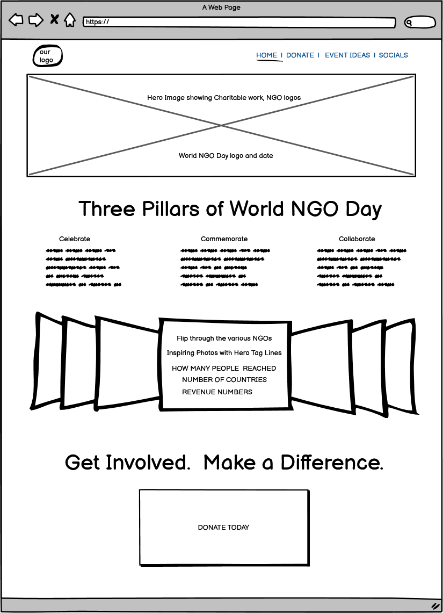
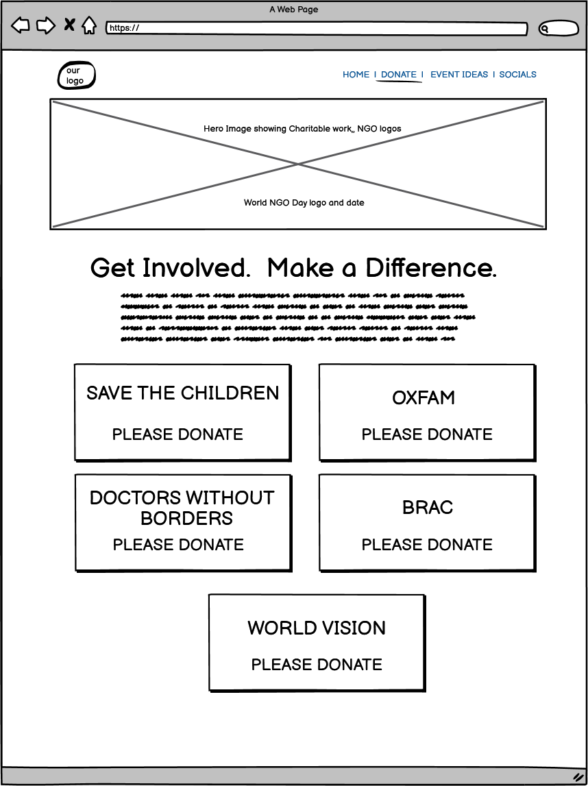
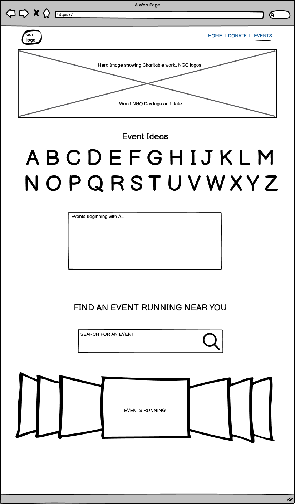
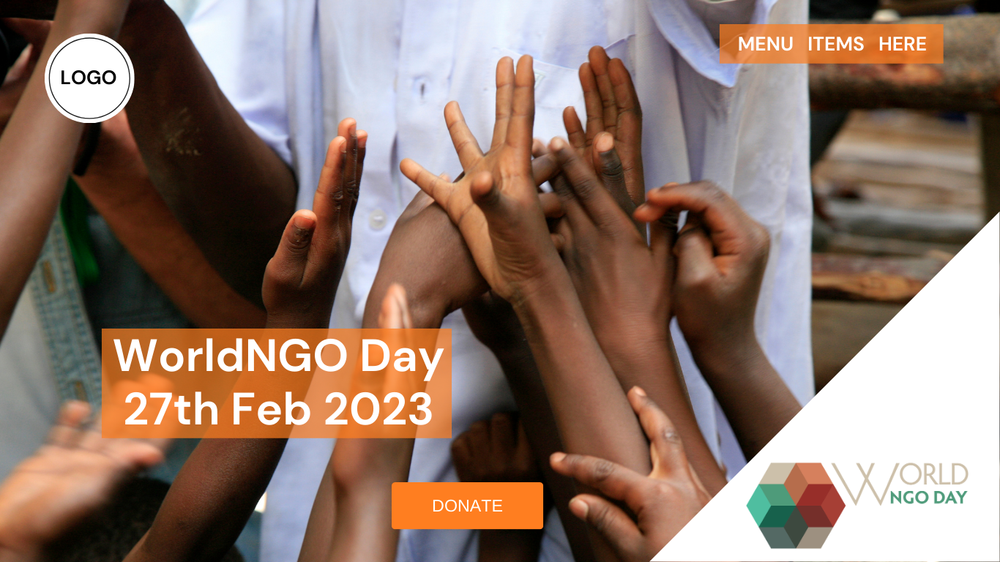
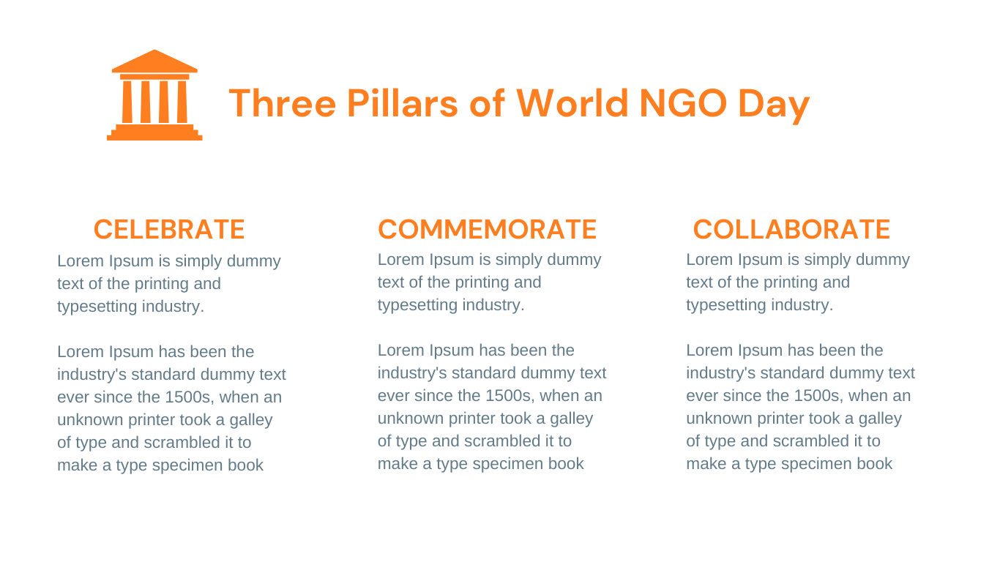
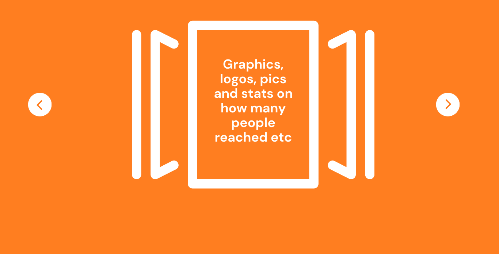
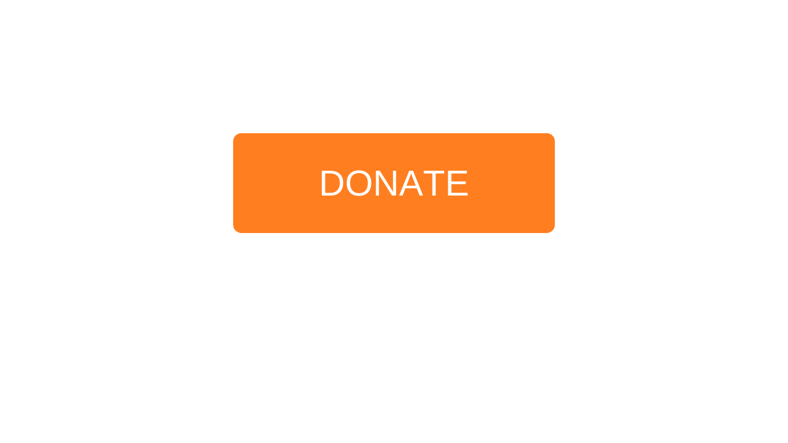
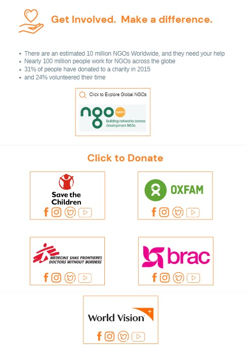
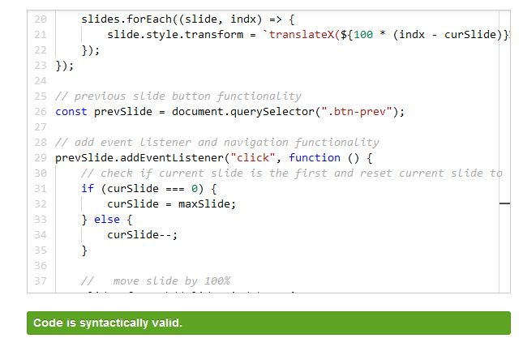

# Helping Hands
This project was made during the "Hackathon-Feb-2023: *World NGO Day February 27th*" at Code Institute.

## Team Name: Helping Hands
​
[Link to Deployed Project](https://helping-hand-ci.herokuapp.com)
​
## Contents(#contents)
​
* [User Experience (UX)](#user-experience)
  * [User Stories](#user-stories)
* [Technology](#technology)
* [Design](#design)
  * [Color Scheme](#color-scheme)
  * [Typography](#typography)
  * [Imagery](#imagery)
  * [Wireframes](#wireframes)
* [Deployment & Usage](#deployment)
* [Testing](#testing)
* [Credits](#credits)
  * [Code](#code)
  * [Content](#content)
  * [Media](#media)
  * [Acknowledgements](#acknowledgements)
​
## User Experience
We wanted to cater to users wondering how they can help and/or donate to NGOs.
​
### User stories
We wanted the user to:
* Find NGOs they can donate to.
* Find events they can take part in.
* See what each featured organisation does.
* Navigate the website easily.

We wanted the admin to:
* Be able to add, delete or change the featured organisations.
* Be able to add, delete or change the events on the website.
​
## Technology

### Requirements
```
asgiref==3.5.2
chardet==3.0.4
click==8.1.3
dj-database-url==0.5.0
Django==3.2.16
django-allauth==0.41.0
gunicorn==20.1.0
idna==2.8
itsdangerous==2.1.2
oauthlib==3.1.1
psycopg2==2.9.5
psycopg2-binary==2.9.5
python3-openid==3.2.0
pytz==2022.6
requests==2.22.0
requests-oauthlib==1.3.0
sqlparse==0.4.3
urllib3==1.25.11
Werkzeug==2.2.2
whitenoise==6.3.0
```
​
### Languages
* HTML
* CSS
* JavaScript
* Python

​
### Tools & Frameworks
* Balsamiq - Used for wireframes
* Canva - Used for initial design ideas
* Brandcrowd - AI Logo generation
* Bootstrap - Used for styling
* Django - Used for backend
* PostgreSQL - Used for the database. The database is hosted on [ElephantSQL](https://www.elephantsql.com/)
​
## Initial MVP idea:
​
Our idea started out as a simple website for finding NGOs. When decided to create a home page, an event page, a donation page, and a socials page. We also wanted a search bar.
​
## Actual idea & content:
​
To streamline the project, we combined the socials page and donate page into a single page. We also removed the search bar due to time constraints. We also developed the way the navigation looked.

The website has three pages:
### Home page
The home page has a unique logo designed with [Canva](https://www.canva.com/) and an inspiring Hero image with overlay text and information about World NGO Day and how people can support NGOs. It also links to the donate page and a carousel with images from the different NGOs.

### Donate page
The donate page has a different hero image and inspiring overlay text. 
Below the hero image is some general information on how people contribute to NGOs. The lower part of this page is taken up by a list of different NGOs. Each item in the list has information about the organisation and an image with its logo. There is also a button where the user can Donate Directly to each NGO.  

The information about each NGO is stored in a database, which makes it easy to edit, delete or add organisations.

### Event page
This page also has a different hero image and overlay text and displays events people can attend. There are filter buttons above the list of events. These contain all the locations (the country the event is in). The list below contains basic information about the event, and a button allowing the user to book or participate in the event.

The information about each NGO is also stored in a database, which makes it easy to edit, delete or add events. This is especially useful since the events need to be deleted from the website after taking place.

Other features:
### Navigation
The navigation consists of a navigation bar on the right and the site's logo on the left. The logo links to the home page, and the three different items in the navbar link to the pages shown above (home, donate, events). The text is white on an orange background.

### Footer
​The footer has links to social media and copyright information. Here too, the text is white on an orange background.
​
## Design
​
### Colour Scheme
We chose an orange and white colour palette, with dark grey for standard text items. These colours are used consistently across all the pages and work well with our layout ideas.
​
### Typography
We chose Helvetica due to it being the one used on the WorldNGO website. and was specified in their [marketing tools](https://worldngoday.org/portfolio-item/marketing-tools/).  To make the two websites feel connected, we too chose to use it. It is also san serif, which is easier to read on screens than serif fonts. 
​
### Imagery
We have several hero images and logos for different organisations. The logos are used in the list of featured organisations. It helps people to recognise the different NGOs.  There are other inspiring NGO / charity work images in the slider.  Various icons were used from font awesome and Canva to make the site visually interesting. 

### Wireframes and mockups

#### Wireframes





#### Mockups





​
## Future Developments​

* Implement Favicon for the website.
* Search functionality for the Donate and Event page for the user to be able to search for an Organisation or Events of their choosing.
* Filter and Category for Event page to better filter result for user.

## Deployment
This project was deployed with Heroku, and used Whitenoise for its static files.


### Deployment Steps

* Create an account at Heroku, and do not forget you need to confirm your e-mail to do this.
* Create a list of dependencies in a text file named requirements (pip3 freeze > requirements.txt).
* Create an app by clicking the "create a new app" button found on the dashboard.
    * Choose a unique app name.
    * Choose your region and click "create app"
* Click on settings (for the app).
    * Find the Config Vars section and add potential files that you cannot upload to GitHub. For example API credentials. KEY is the title, and VALUE is the content. For this project you need to add the Django key and the database-url.
    * Add buildpacks (below Config Vars). For this project, I installed Python and Node.js. Make sure they are in the correct order.
* Go to the deploy section.
    * Choose to deploy from GitHub.
    * Connect your account and choose a repository to deploy from.
    * Choose either Automatic or Manual deployment (recommended).
* Follow the steps on this page to set up Whitenoice. This is the same instructions I used. Don't forget to run the command "python3 manage.py collectstatic".
* Make sure your images are on an external site, like ibb. This prevents errors related to the images.
* Make sure the live site is working.

### Deployment Issues

* The initial deployment was not successful due to the structure of the files and the software not being able to locate said files.
* An attempt to reorgansie the file was made but we still stumble upon deployment issue.
* Due to the fact that the repository owner does not have access to Heroku for deployment, the website is deployed from a forked repository by a member of the team who have access to Heroku.

​
## Testing

### User stories testing
The user can successfully:
* Find NGOs they can donate to.
    * These can be found on the donate page.
* Find events they can take part in.
    * These can be found on the events page.
* See what each featured organisation does.
    * The organisation summary explains what each organisation does.
* Navigate the website easily.
    * There is a navbar at the top of the website. On larger screens, it is in the same position regardless of what page you are on.  On smaller screens, it adjusts and centers in the middle of the hero image.

The admin user can successfully:
* Add, delete or change the featured organisations.
    * This can be done on the [admin page]()
* Add, delete or change the events on the website.
    * This can be done on the [admin page]()
* Add, delete or change the location on the website.
    * This can be done on the [admin page]()

### Device testing
This website was tested natively on these devices:
- Desktop Computer (25" screen)
- Acer Aspire 5 (15" screen)

It was also tested on these devices with Mozilla- and Google dev tools:


### Browser testing
This website was tested on the following browsers:
* Mozilla Firefox
* Google Chrome
* Microsoft Edge
* Safari
* DuckDuckGo (mobile)

### Validator testing

* HTML - I put the HTML documents through the W3C validator. It did not return any errors not related to the use of Django.
* CSS - All CSS is validate through W3C validator, however, there was a parse error due to the import fonts code at the top of the page, so we decided to leave that it due to the time constriant of the deployment.
* Python - I put the code through the Code Institute [pep8 linter](https://pep8ci.herokuapp.com/). Got no errors except "line too long".
* JavaScript - I ran the JavaScript through the [JS validator](https://jsvalidator.com/) and got no errors.



### Lighthouse

### Manual Testing
* We tested if the data from the backend showed up correctly by asking the page to show it. 
* We did the testing of the image link in a similar way. When the name of the image-file had been added, we checked if it showed up in the frontend. If it did not, we inspected the page and checked what the link looked like in reality. That helped us find the problems.

### Bugs

#### Fixed bugs
* At first the logo images for the organisations did not show up. This was due to us having accidentally added an extra slash. To figure this out we inspected the page in the browser.

* Fixed an issue where the body tag wasn't completely filling the html tag. After searching through all the css I could not locate the issue. I used a block of generic code from reset css and it was able to remove the whitespace at the top of the pages.

#### Unfixed bugs​

* The Nav bar is diplaying the incorrect order of the menus when screen size is less 790px

## Credits
Hero Images - Unsplash
* [Home page hero image](https://unsplash.com/photos/_P9fwHnwhcA)
* [Donate page hero image](https://unsplash.com/photos/3k3l2brxmwQ)
* [Event page hero image](https://unsplash.com/photos/YwpFllVSpvU0)
* [Mobile slide image](https://unsplash.com/photos/sjuLxUOEMY8)
* Slider Images - Unsplash
* Icons - FontAwesome and Canva
* Content - various NGO websites including Save the Children, Oxfam, Doctors without Borders, BRAC, World Vision, WorldNGODay.org, blog.waytobill.com
​
### Code

* Used a block of code from https://meyerweb.com/eric/tools/css/reset/ to avail of reset css to remove whitespace at the top of the pages. Noted in comments of the CSS.

* Use of code block from Love  Running Walkthrough Project

​
### Content
The organisation and event summaries are taken from the organisations websites. These can be found on the page right below the summary.  
Other content was taken from various NGO websites as listed above.

The deployment part of the readme is the same as in Erik's (team-member) [Project 4](https://github.com/11bus11/theatre-booking).
​

​
### Acknowledgements
Huge thanks to everyone on the team who worked exceptionally hard to pull this amazing project together in such a short time.
* Erik Vodopivec Forsman
    * [LinkedIn](https://www.linkedin.com/in/erik-vodopivec-forsman-485b61217)
    * [GitHub](https://github.com/11bus11)
* James Supachok Kasetarapanya
    * [LinkedIn](https://www.linkedin.com/in/james-kasetarapanya-86602585/)
    * [GitHub](https://github.com/yamesjamess)
* Russell Stanley Smith
    * [LinkedIn](https://www.linkedin.com/in/russellstanleysmith/)
    * [GitHub](https://github.com/rstan-dev)
* Jack Crosbie
    * [LinkedIn](https://www.linkedin.com/in/jack-crosbie-27770224a/)
    * [GitHub](https://github.com/jackcrosbie)
* George Philip
